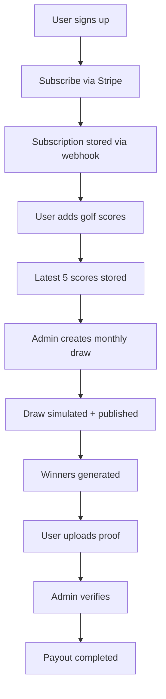

# 🏌️ Golf Charity Platform

> A full-stack subscription platform that blends **golf performance, real rewards, and meaningful impact**.

Built to simulate a **real-world SaaS product**, this system combines:
- 📊 Score tracking
- 🎁 Monthly reward draws
- ❤️ Charity contributions
- 💳 Subscription billing

---

## 🌍 Live Demo

👉 https://golf-charity-platform-woad-gamma.vercel.app

---

## 🧠 The Idea

Most golf apps track performance.  
Some platforms offer rewards.  
Very few connect **personal improvement → incentives → impact**.

This platform does all three.

> You play better → you stay consistent → you contribute → you get rewarded.

---

## ⚙️ Core Product Flow


---

## ✨ Features

### 🔐 Authentication & Roles
- Supabase Auth (email/password)
- Role-based system (admin vs subscriber)
- Secure session handling (server-side)

---

### 💳 Subscription System (Stripe)
- Monthly & yearly plans
- Stripe Checkout integration
- Webhook-driven state sync
- Access gating based on subscription status

---

### 📊 Golf Score Engine
- Stores only latest 5 scores
- Automatic rolling replacement
- Stableford scoring format
- Reverse chronological ordering

---

### 🎯 Monthly Draw System
- Admin-controlled draw lifecycle:
  - Draft → Simulate → Publish
- Score snapshot-based entry system
- Match tiers:
  - 3-match
  - 4-match
  - 5-match (jackpot)
- Prize pool distribution
- Jackpot rollover logic

---

### 🏆 Winner Flow
- Users upload proof (image/PDF)
- Stored securely via Supabase Storage
- Admin review system:
  - Approve / Reject
- Payment tracking:
  - `pending → paid`

---

### 🛠 Admin Dashboard
- Create & manage draws
- Simulate outcomes before publishing
- Review winner claims
- Platform analytics overview

---

### ❤️ Charity System
- Select a charity
- Choose contribution %
- Track user preference
- Designed for future impact reporting

---

## 🧱 Tech Stack

| Layer        | Tech |
|-------------|------|
| Frontend     | Next.js (App Router, Server Components) |
| Backend      | Server Actions (no REST bloat) |
| Database     | Supabase (PostgreSQL + RLS) |
| Auth         | Supabase Auth |
| Payments     | Stripe |
| Storage      | Supabase Storage |
| Deployment   | Vercel |

---

## 🧩 Architecture Highlights

### 🔒 Row-Level Security (RLS)
- All user data is protected at the database level
- No reliance on frontend trust

---

### ⚡ Server Actions
- Direct DB + Stripe interaction
- Eliminates API layer complexity
- Cleaner, more maintainable architecture

---

### 🔁 Webhook-Driven Sync
- Stripe events → Supabase state
- Ensures source of truth = Stripe

Handles:
- subscription activation
- renewal
- cancellation

---

### 📦 Lazy Initialization (Stripe Fix)
- Prevents Vercel build failures
- Ensures runtime-only secret usage

---

## 🚀 Getting Started

### 1. Clone

```bash
git clone https://github.com/YOUR_USERNAME/golf-charity-platform.git
cd golf-charity-platform
```

### 2. Install

```bash
npm install
```

### 3. Create Environment Variables `.env.local`

```bash
NEXT_PUBLIC_SUPABASE_URL=
NEXT_PUBLIC_SUPABASE_ANON_KEY=
SUPABASE_SERVICE_ROLE_KEY=

NEXT_PUBLIC_APP_URL=http://localhost:3000

STRIPE_SECRET_KEY=
STRIPE_WEBHOOK_SECRET=
```

### 4. Run

```bash
npm run dev
```

## 🗄 Database Setup

- Create Supabase project  
- Run `init.sql`  

### Enable:
- RLS  
- Storage bucket: `winner-proofs`  

---

## 💳 Stripe Setup

### Create products
- Monthly  
- Yearly  

### Add webhook

```txt
https://your-domain.vercel.app/api/stripe/webhook
```

### Events:

- `checkout.session.completed`
- `customer.subscription.updated`
- `customer.subscription.deleted`

### 🚀 Deployment

```bash
vercel --prod
```

### 🧪 Testing Checklist

- Signup / login
- Subscription checkout
- Webhook updates DB
- Dashboard unlocks
- Add scores (max 5)
- Create + publish draw
- Upload proof
- Admin approves
- Mark payout as paid

### 📌 What This Project Demonstrates

- End-to-end SaaS architecture
- Payment systems + webhooks
- Secure database design (RLS)
- Admin workflows
- Real-world product thinking
- Production deployment
  
### 🧠 Lessons & Challenges

- Handling Stripe webhooks across environments
- Avoiding build-time secret crashes (lazy init pattern)
- Designing clean server-action architecture
- Maintaining data integrity with rolling score logic
- Syncing multiple systems (Stripe ↔ Supabase)
  
### 🔮 Future Improvements

- Email notifications (wins, renewals)
- Leaderboards
- Charity impact analytics
- Mobile app (React Native)
- Fraud detection for proof uploads

### 🙌 Acknowledgements

- https://nextjs.org
- https://supabase.com
- https://stripe.com
- https://vercel.com
